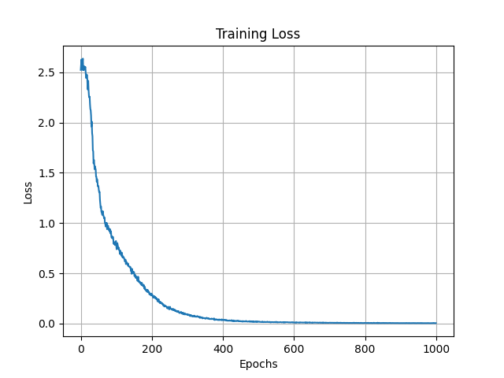
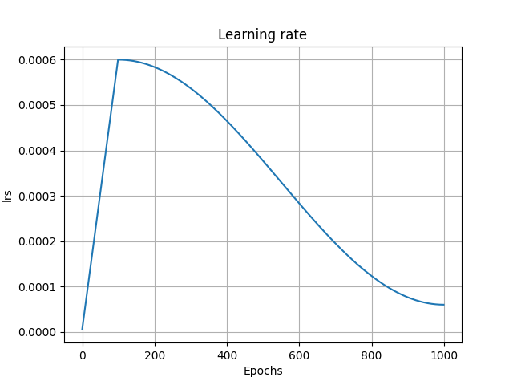

# LoRA Finetuning from Scratch

A from-scratch implementation of **parameter-efficient fine-tuning (LoRA)** for a GPT-style language model in PyTorch.

This project demonstrates an end-to-end pipeline:
- Pretraining a Transformer on Tiny Shakespeare  
- Adapting it using LoRA on a structured instruction dataset  
- Converting a text generator into a question-answering assistant

---

## Overview

This repository shows how a pretrained language model can be efficiently adapted by training only a **small set of low-rank parameters**, instead of updating the full network.

Pipeline:
1. Pretrain a GPT-style model on raw text  
2. Freeze base model weights  
3. Add LoRA adapters  
4. Fine-tune on prompt/response data  

---

## Features

- GPT-style decoder-only Transformer (from scratch)
- Pretraining on character-level text (`tinyShakespeare.txt`)
- LoRA-based finetuning with frozen base weights
- Latent attention architecture with:
  - grouped latent key/value pathway
  - RoPE applied to subset of dimensions
  - NoPE / RoPE decomposition
- Mixture-of-Experts (MoE)
- Gradient accumulation
- Prompt/response masking (train only on answers)
- Side-by-side comparison of pretrained vs finetuned outputs

---

## Repository Structure

```
.
├── config.py               # Hyperparameters, training config, device setup
├── data.py                 # Pretraining dataset loading and batching
├── data_finetuning.py      # Finetuning dataset loading, padding, and masking
├── model.py                # Base pretrained GPT-style model (attention + MoE)
├── lora_model.py           # LoRA-wrapped model (injects low-rank adapters)
├── train.py                # Pretraining script
├── train_finetuning.py     # LoRA finetuning script
├── sample.py               # Compare pretrained vs finetuned outputs
├── tinyShakespeare.txt     # Pretraining corpus
├── finetuning_dataset.txt  # Finetuning Q&A dataset
├── README.md
```

---

## Setup

Install dependencies:
```bash
pip install torch matplotlib
```

---

## Training Pipeline

### 1. Pretraining

Run:
```bash
python train.py
```

This:
- trains on Tiny Shakespeare
- learns language structure and style
- saves:
```
model_pretrained.pth
```

Reference implementation:
https://github.com/rifath95/transformer-from-scratch

---

### 2. LoRA Finetuning

Run:
```bash
python train_finetuning.py
```

This:
- loads pretrained weights
- freezes base model
- trains only LoRA parameters
- saves:
```
model_finetuned.pth
```

---

## LoRA Setup

LoRA replaces weight updates with:

$$
W = W_{\text{base}} + \frac{\alpha}{r} A B
$$

- Base weights are frozen  
- Only low-rank matrices \(A, B\) are trained  
- Applied to:
  - Attention projections  
  - Expert MLP layers  

Benefits:
- Fewer trainable parameters  
- Faster training  
- Lower memory usage  

---

## Finetuning Objective

Dataset format:
```
<question>:ANSWER:<answer>:END:
```

During training:
- Loss is computed only on answer tokens  
- Prompt tokens are masked out  

This setup mimics supervised instruction tuning.

---

## Sample Outputs

### Prompt: Tell me who Caius Marcius is.

**Pretrained Model**
```
Then see here from as the childrens of birth,
And these hand so our lawful times of my sweet,
And s
```

**Finetuned Model**
```
Caius Marcius is a Roman warrior.:END:
```

---

### Prompt: Why is pride dangerous?

**Pretrained Model**
```
Go his old the wilt of this bewing of heaven,
Both our promised it hath substitute will bestand:
Wh
```

**Finetuned Model**
```
Pride may courage honour in the hearts of men.:END:
```

---

### Prompt: What is loyalty?

**Pretrained Model**
```
We know help to assent worth the best have lady.
```

**Finetuned Model**
```
Mercy is gentle pity shown to another.:END:
```

---

### Prompt: What made the citizens angry?

**Pretrained Model**
```
I shall you for the hamour errold to thee her.
```

**Finetuned Model**
```
The citizens are angry because they are hungry and want corn.:END:
```

---

## Training Dynamics

The plots below show the **finetuning training dynamics**.

<p align="center">
  
  
</p>

---

## Observations

### What works
- Learns structured Q&A format  
- Strong performance on seen and similar prompts  
- Successfully shifts from Shakespeare-style generation to QA behavior  

### Limitations
- Weak reasoning on complex questions  
- Errors on abstract concepts  
- Sensitive to prompt phrasing  
- Short-answer bias  

---

## Key Insights

- The model becomes the dataset  
- LoRA enables fast behavioral adaptation  
- Data quality matters more than training duration  

---

## Run Everything

Pretrain:
```bash
python train.py
```

Finetune:
```bash
python train_finetuning.py
```

Sample:
```bash
python sample.py
```

---

## Future Improvements

- Larger and more diverse instruction dataset  
- Conversational fine-tuning (chat-style)  
- Apply LoRA to more components  
- Add evaluation benchmarks  
- Switch to subword tokenization  
